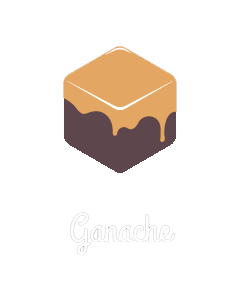
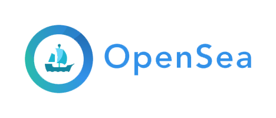

- 👋 Hi,we are @BlockAudit-Report
- 👀 we make DeFi DApp, Token, Coin or BlockChain Audit Report Platform
- Telegram : @BlockAuditReport
- Website  : https://BlockAudit.Report
- 🌱 

### 🔭 We usually work on ...

  
   
  

 

  
   

  
   

  
   

  
   

### DevOps

  
  
  

  
### CSPs
  
 

   &nbsp;&nbsp;
  
 

### Databases
  
 

  <a href="https://www.postgresql.org/" target="_blank" >
    &nbsp;&nbsp;
  </a>
    <a href="https://www.prisma.io/" target="_blank" >
    &nbsp;&nbsp;
  </a>
  

### 📫 How to reach me? 

  ⦿ Connect with me on [LinkedIn](https://www.linkedin.com/in/noor-alam-aa722314b/) 👨🏻‍💻  
  ⦿ Follow me on [Twitter](https://twitter.com/BlockAudit) 🦠 
  ⦿ Send an [Email](mailto:team@Blockaudit.Report) 💌  
   
<!--
**** is a ✨ _special_ ✨ repository because its `README.md` (this file) appears on your GitHub profile.

Here are some ideas to get you started:

- 🌱 I’m currently learning ...
- 👯 I’m looking to collaborate on ...
- 🤔 I’m looking for help with ...
- 💬 Ask me about ...
- 📫 How to reach me: ...
- 😄 Pronouns: ...
- ⚡ Fun fact: ...
-->

<!--
Inspired By https://github.com/itsksaurabh/itsksaurabh
-->
